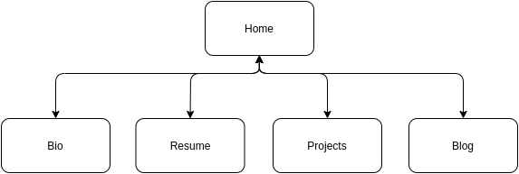
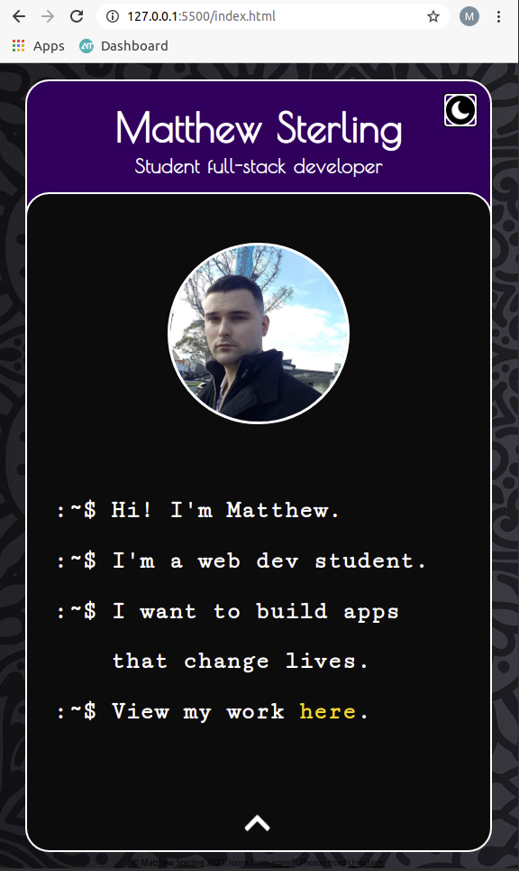
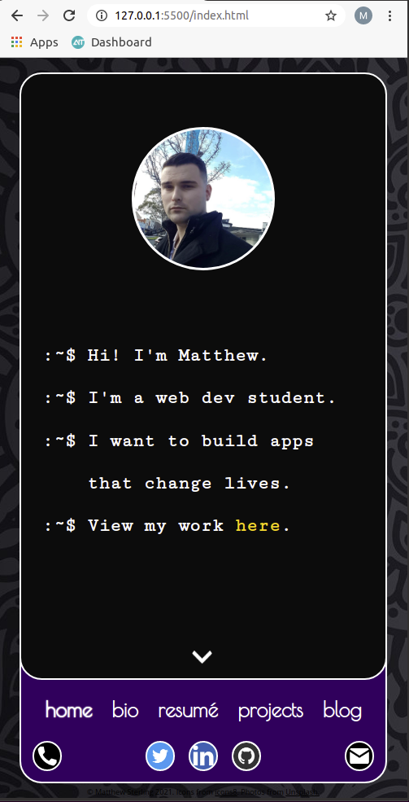
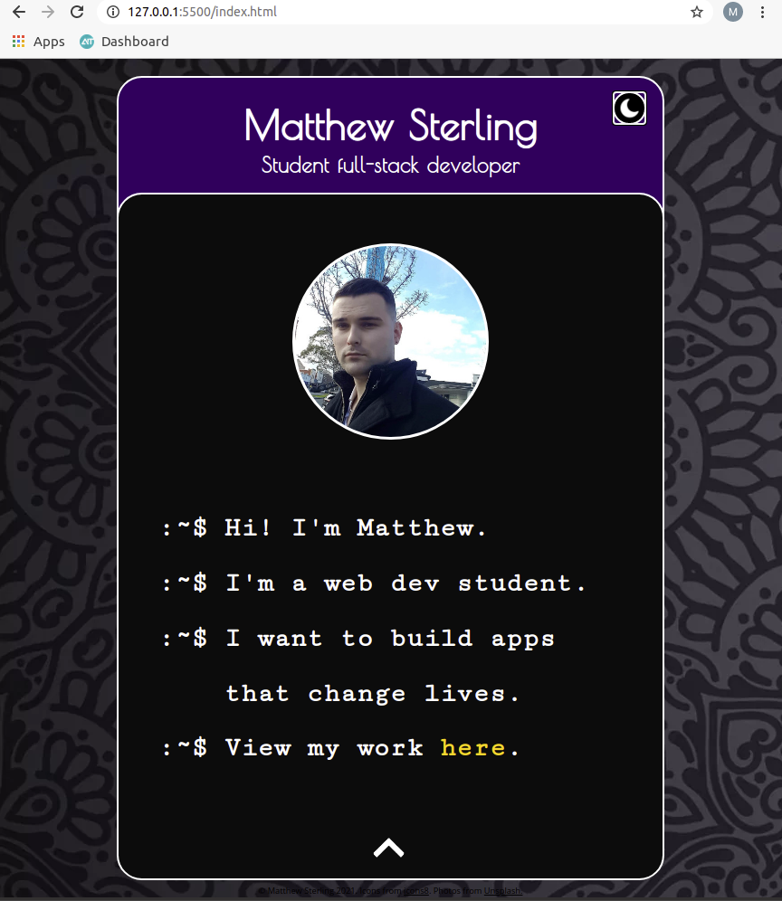
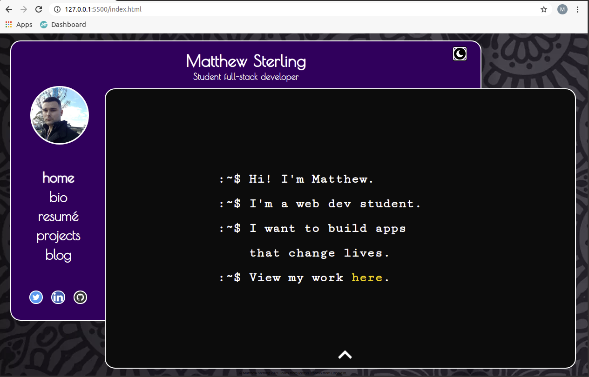
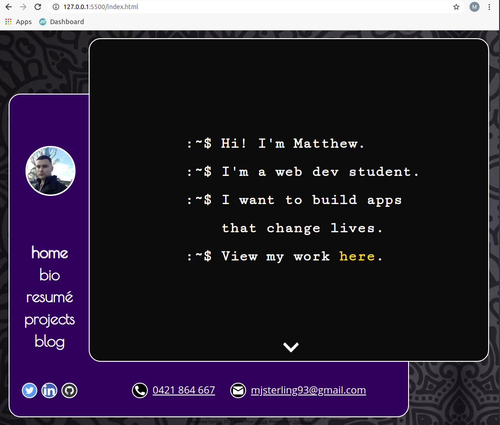
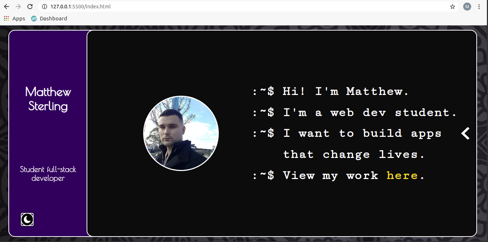
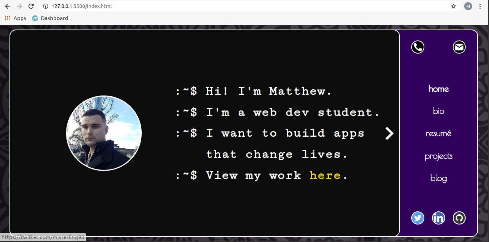
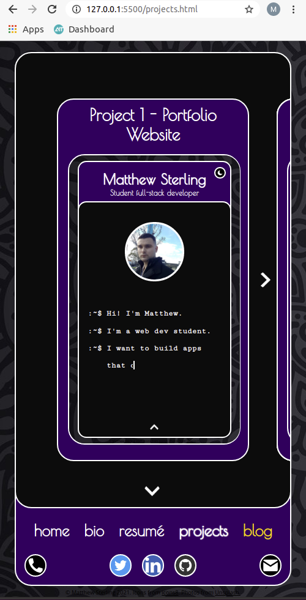
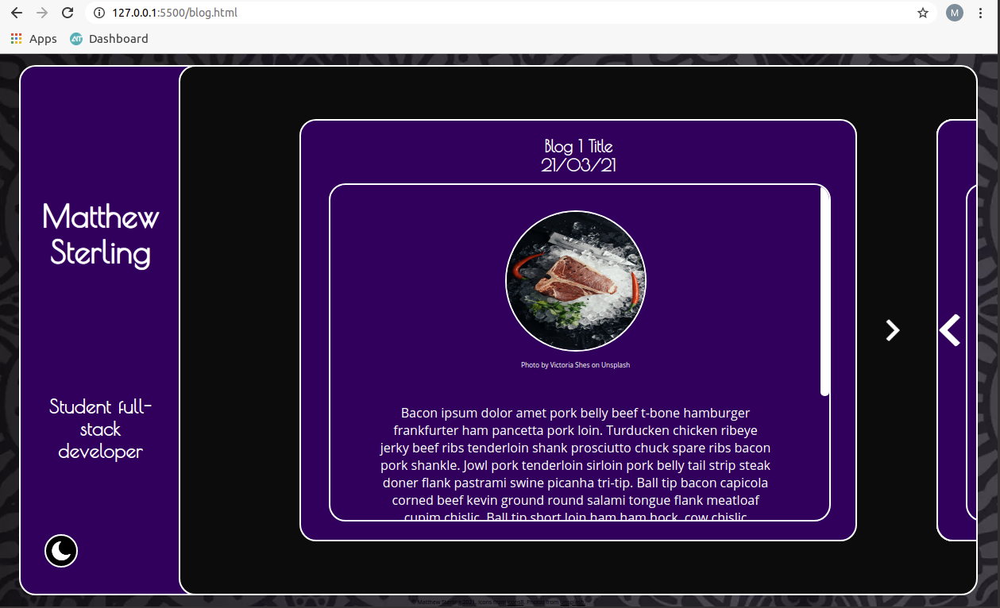

# T1A2 - Portfolio Website

## Table of Contents

### 1. [Purpose](##Purpose)
### 2. [Functionality / Features]((##Functionality/Features))
### 3. [Sitemap](##Sitemap)
### 4. [Screenshots](##Screenshots)
### 5. [Target Audience](##Target&nbsp;Audience)
### 6. [Tech Stack](##Tech&nbsp;Stack)
### 7. [Links](##Links)

## Purpose

This project is a personal portfolio website intended to be delivered as part of the T1A2 assessment for Coder Academy.
In addition to this, I intend it to be used and updated throughout my career as a software engineer as a compact representation of my skills, abilities, and personality.

## Functionality/Features

The website consists of five HTML documents interlinked by a navigation bar. In order to save valuable screen real estate on mobile and engage the user, it features a clean, fun and interactive design based on a deck of cards, wherein the user move the cards on the page to toggle between the title of the page or a menu, using navigation arrows or drag/swipe gestures.

The site also features:
- Click-to-call and click-to-email buttons;
- Links to Github, LinkedIn and Twitter;
- 100% responsiveness within an approximate aspect ratio range of 1/3 to 8/3;
- An optional dark mode that uses `localStorage` to persist between pages and sessions.

## Sitemap

The site has a single-level horizontal structure which enables ease of navigation. Each page is accessible from each other page.

Project and blog components are embedded directly inside the projects.html and blog.html pages to simplify the structure.

## Screenshots

### Mobile (portrait):

### Tablet:

### Desktop:

### Mobile (landscape):

### Other pages:

## Target&nbsp;Audience

This site is intended for use by industry recruiters and the general public - I will be creating a QR code for it to put on matching-themed business cards, as well as a link to it on my LinkedIn page.

## Tech&nbsp;Stack

The site was built using HTML, CSS and JavaScript, and deployed using Netlify.

## Links

Website is hosted at https://matthew-sterling.netlify.app

### &copy; Matthew Sterling 2021
